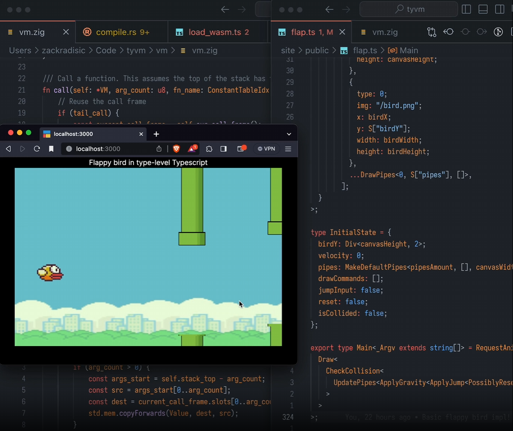

# Incredible Things People Built With TypeScript

TypeScript's type system is [Turing Complete](https://github.com/microsoft/TypeScript/issues/14833). In other words, you can use it to run any algorithm. Should you? Probably not. But that hasn't stopped a few [preoccupied scientists](https://www.youtube.com/watch?v=_oNgyUAEv0Q) from stretching TypeScript to its limits.

## Flappy Bird



Let's start with the maddest. [`zack_overflow`](https://x.com/zack_overflow) built [**Flappy Bird in TypeScript's type system**](https://zackoverflow.dev/writing/flappy-bird-in-type-level-typescript/). Yes, you can [play it](https://tyvm.100x.software/). And yes, it's written only in TypeScript types.

He got this working by creating a custom type-level TypeScript runtime, written in [Zig](https://ziglang.org/), that can run TypeScript types as if they were runtime code.

The code to draw the pipes? A [generic type](https://www.totaltypescript.com/books/total-typescript-essentials/designing-your-types-in-typescript#generic-types). The code to check collisions? A generic type. Every piece of runtime code you'd usually capture in a function is now a type.

To put it mildly, TypeScript's type system has very few limits. Is it wise to write Flappy Bird in the type system? No. But the fact it's possible is mind-expanding.

## `gql.tada`

Let's get more practical. GraphQL and TypeScript typically have a fraught relationship. You query GraphQL endpoints with strings:

```ts
const query = `
  query {
    user {
      id
      name
    }
  }
`;

const result = await fetchFromGraphQLEndpoint(query);
//    ^ How do type this?
```

`result` here can't usually be strongly typed. You can't know that it's returning a `user` object with an `id` and a `name`.

It's common to patch over this with [codegen](https://the-guild.dev/graphql/codegen), which works [well enough](https://www.youtube.com/watch?v=5weFyMoBGN4).

But [`gql.tada`](https://gql-tada.0no.co/get-started/) takes a different approach. They have written a **GraphQL string parser in TypeScript**. You wrap your queries in a function call, and boom:

```ts
import { graphql } from "gql.tada";

const query = graphql(`
  query {
    user {
      id
      name
    }
  }
`);

const result = await fetchFromGraphQLEndpoint(query);
//    ^ Typed as { id: string; name: string }
```

How is it doing this? The magic of [template literal types](https://www.totaltypescript.com/books/total-typescript-essentials/designing-your-types-in-typescript#template-literal-types-in-typescript). TypeScript's type system is reading the string passed in, and inferring the type of the result.

It's incredible, and surprisingly fast. If I were starting a GraphQL project today, this is how I'd query it.

## MistCSS

[MistCSS](https://github.com/typicode/mistcss) is a bonkers take on creating custom components in TypeScript apps. It does something I've never seen before - generating TypeScript code from CSS.

You write some CSS, with some `data-*` attributes specified:

```css
button {
  &[data-variant="primary"] {
    background-color: black;
  }

  &[data-variant="secondary"] {
    background-color: grey;
  }
}
```

Then, you can write some JSX, with a `data-variant` property - and the `data-variant` is strongly typed:

```tsx
<>
  <button data-variant="primary">Save</button>
  <button data-variant="secondary">Save</button>

  <button data-variant="tertiary">Save</button>
  {/*                   ^^^^^^^^ Error! */}
</>
```

It works by generating some types in the [global scope](https://www.totaltypescript.com/books/total-typescript-essentials/modules-scripts-and-declaration-files) which influences the [props of the JSX Elements](https://www.totaltypescript.com/what-is-jsx-intrinsicelements) available:

```ts
declare namespace JSX {
  interface IntrinsicElements {
    button: CustomButtonProps; // MistCSS-generated type
  }
}
```

So you write some CSS, and you get a strongly-typed component out of it. I think I'll be sticking to [Tailwind](https://tailwindcss.com/) - but the idea is fascinating.
