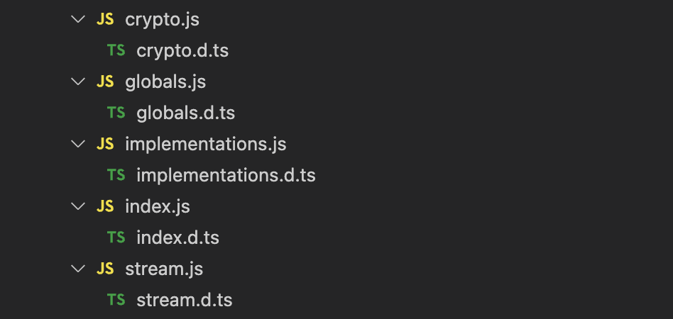

I've changed my mind on .d.ts files.

If you're writing application code, you should NEVER use them.

Let me explain 🧵

---

Declaration files are files that only contain types.

They've got two purposes - providing types for JavaScript files, and augmenting types in the global scope.

Here's the section on them in my book:

https://www.totaltypescript.com/books/total-typescript-essentials/modules-scripts-and-declaration-files#declaration-files

---

You'll see them a lot in your node_modules folder. Every package comes with a lot of .d.ts files to provide types for the JavaScript files they ship.



---

Since you don't control these types, you shouldn't receive type errors from them - so there's a setting in your tsconfig.json to disable them.

It's called `skipLibCheck`, and I recommend it for all TS projects.

```json
{
  "compilerOptions": {
    "skipLibCheck": true
  }
}
```

---

However, this has an unfortunate downside. It also means that `.d.ts` files you write yourself will never show TypeScript errors.

For instance, you can't add implementations to functions in `.d.ts` files:

```ts twoslash
// @filename: my-file.d.ts
// @skipLibCheck: false
// @errors: 1183

// ---cut---
// my-file.d.ts
export function myFunc() {
  return "hello";
}
```

---

But with `skipLibCheck` set to `true`, it appears like you can:

```ts twoslash
// No error!
export function myFunc() {
  return "hello";
}
```

---

You might be asking - what can `.d.ts` files do that `.ts` files can't?

Well, not much. You can emulate the behavior of a global `.d.ts` file with `declare global` in a `.ts` file:

```ts twoslash
// my-file.ts
declare global {
  // Id is now available globally!
  type Id = string | number;
}

export {};
```

---

As a side note, `export {}` is important sometimes, depending on whether your tsconfig treats the file as a module or a script.

There's a bit of the book for that:

https://www.totaltypescript.com/books/total-typescript-essentials/modules-scripts-and-declaration-files#understanding-modules-and-scripts

---

`declare global` lets you do everything you'd need to do in a `.d.ts` file, but with type checking enabled.

It has the same limitations, too - no implementations allowed:

```ts twoslash
// @filename: my-file.ts
// @errors: 1183
// ---cut---
declare global {
  function myFunc() {
    return "hello";
  }
}
```

---

The only thing I've found that `declare global` can't do is totally override the types of another module.

But this is so rarely needed that it almost doesn't count towards this argument.

https://www.totaltypescript.com/books/total-typescript-essentials/modules-scripts-and-declaration-files#module-augmentation-vs-module-overriding

---

So, since:

- `skipLibCheck` MUST always be set to `true`, meaning `.d.ts` files are never type-checked.
- `declare global` can do 99% of what `.d.ts` files can (and the last 1% is rarely needed)

I've started to recommend never using `.d.ts` files in application code.
